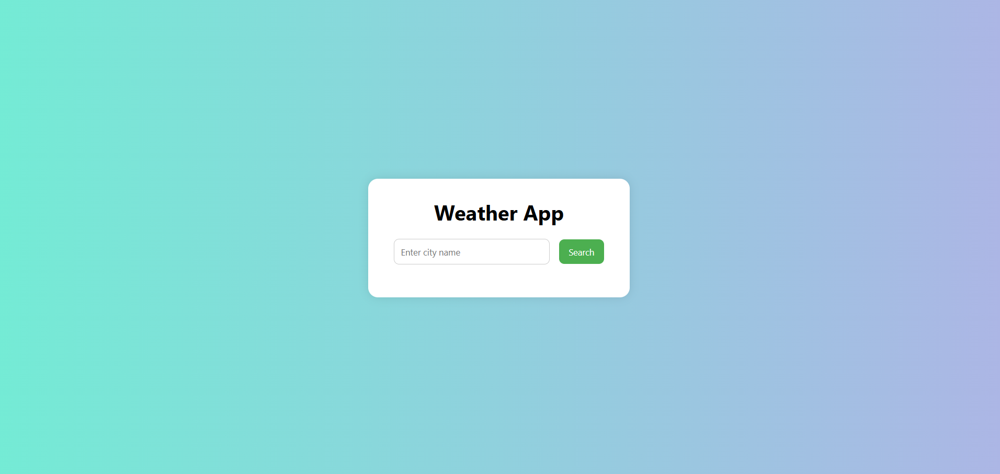

# Weather App 

A simple weather forecast app that shows the current temperature, humidity, and weather conditions for any city, using the OpenWeatherMap API.

## Built With

- HTML
- CSS
- JavaScript (Fetch API)
- OpenWeatherMap API

## Preview

## Features

- Search for any city
- Get real-time weather data
- Displays temperature, humidity & condition
- Responsive design

## Live Demo

👉 [Click here to view the live app](https://snehamp12.github.io/weather-app/)

## API Used

- [OpenWeatherMap API](https://openweathermap.org/api)

## Author

- [Sneha MP](https://github.com/snehamp12)
